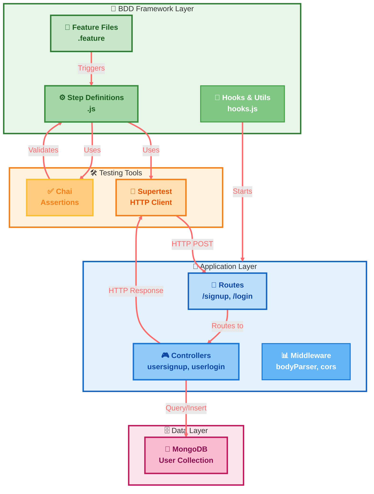
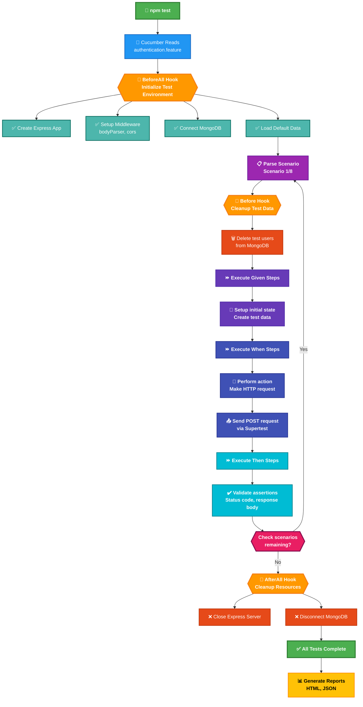
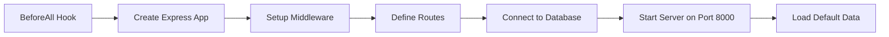
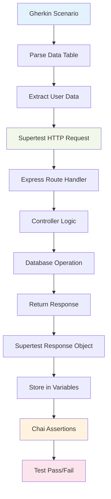

# Cucumber Testing Framework Guide

## Overview

This guide explains how the Cucumber BDD (Behavior Driven Development) testing framework works in your e-commerce project, including integration with Supertest for API testing and Chai for assertions.

## Table of Contents

1. [Architecture Overview](#architecture-overview)
2. [Test Execution Flow](#test-execution-flow)
3. [File Structure](#file-structure)
4. [Key Components](#key-components)
5. [Step-by-Step Example](#step-by-step-example)
6. [Testing Tools Integration](#testing-tools-integration)
7. [Best Practices](#best-practices)

## Architecture Overview



## Test Execution Flow



## File Structure

```
server/
├── features/
│   ├── authentication.feature          # Gherkin scenarios
│   ├── step_definitions/
│   │   └── authSteps.js               # Step implementations
│   └── support/
│       ├── hooks.js                   # Test lifecycle hooks
│       └── apiHelper.js               # Utility functions
├── cucumber.js                        # Cucumber configuration
└── package.json                       # Dependencies and scripts
```

## Key Components

### 1. Feature Files (Gherkin)

**Purpose**: Define test scenarios in business-readable language

**Example**:
```gherkin
Feature: Authentication APIs
  Test the signup and login endpoints for the e-commerce application

  Background:
    Given the API server is running on "http://localhost:8000"

  Scenario: User signup with valid credentials
    When user submits signup request with:
      | firstname | John      |
      | lastname  | Doe       |
      | username  | johndoe   |
      | email     | john@example.com |
      | password  | password123 |
      | phone     | 9876543210  |
    Then response status code should be 200
    And response should contain user object
```

**Key Elements**:
- **Feature**: High-level description
- **Background**: Common setup for all scenarios
- **Scenario**: Individual test case
- **Given/When/Then**: BDD step types
- **Data Tables**: Structured test data

### 2. Step Definitions

**Purpose**: Implement the logic for each Gherkin step

**Structure**:
```javascript
import { Given, When, Then } from '@cucumber/cucumber';
import { expect } from 'chai';
import request from 'supertest';

// Given steps - Setup initial state
Given('the API server is running on {string}', function(url) {
  apiUrl = url;
});

// When steps - Perform actions
When('user submits signup request with:', async function(dataTable) {
  const signupData = dataTable.rowsHash();
  response = await request(apiUrl)
    .post('/signup')
    .send(signupData);
});

// Then steps - Verify outcomes
Then('response status code should be {int}', function(expectedStatus) {
  expect(response.status).to.equal(expectedStatus);
});
```

### 3. Hooks (Test Lifecycle)

**Purpose**: Manage test setup and cleanup

```javascript
import { BeforeAll, AfterAll, Before } from '@cucumber/cucumber';

BeforeAll(async function() {
  // Start test server
  // Connect to database
  // Load default data
});

Before(async function() {
  // Clean up test data before each scenario
});

AfterAll(async function() {
  // Close server and cleanup resources
});
```

## Step-by-Step Example

Let's trace through the "User signup with valid credentials" scenario:

### Step 1: Test Initialization



### Step 2: Scenario Setup

```javascript
// Before Hook runs before each scenario
Before(async function() {
  // Clean up any existing test users
  const testUsernames = ['johndoe', 'existinguser', 'testuser'];
  await User.deleteMany({ username: { $in: testUsernames } });
});
```

### Step 3: Execute Given Steps

```javascript
Given('the API server is running on {string}', function(url) {
  apiUrl = url; // Sets apiUrl = "http://localhost:8000"
});
```

### Step 4: Execute When Steps

```javascript
When('user submits signup request with:', async function(dataTable) {
  // 1. Parse the data table from Gherkin
  const signupData = dataTable.rowsHash();
  /* Result:
  {
    firstname: 'John',
    lastname: 'Doe',
    username: 'johndoe',
    email: 'john@example.com',
    password: 'password123',
    phone: '9876543210'
  }
  */
  
  // 2. Make HTTP request using Supertest
  response = await request(apiUrl)
    .post('/signup')           // POST to http://localhost:8000/signup
    .send(signupData)          // Send user data in request body
    .catch(err => err.response); // Handle any errors
  
  // 3. Store response for assertions
  responseBody = response.body;
});
```

### Step 5: Execute Then Steps

```javascript
Then('response status code should be {int}', function(expectedStatus) {
  // Use Chai to assert the HTTP status code
  expect(response.status).to.equal(expectedStatus); // expect(200).to.equal(200)
});

Then('response should contain user object', function() {
  // Multiple Chai assertions to verify response structure
  expect(responseBody).to.be.an('object');
  expect(responseBody.message).to.exist;
  
  const userData = responseBody.message;
  expect(userData).to.be.an('object');
  expect(userData.username).to.exist;
  expect(userData.email).to.exist;
});
```

## Testing Tools Integration

### Supertest - HTTP Testing

**Purpose**: Make HTTP requests to your API endpoints

```javascript
// Basic request structure
const response = await request('http://localhost:8000')
  .post('/signup')                    // HTTP method and endpoint
  .send({ username: 'test' })         // Request body
  .set('Authorization', 'Bearer ...')  // Headers (if needed)
  .expect(200);                       // Quick status assertion
```

**Key Features**:
- Makes real HTTP requests
- Supports all HTTP methods (GET, POST, PUT, DELETE)
- Can set headers, cookies, and request body
- Returns response object with status, body, headers

### Chai - Assertions

**Purpose**: Verify that responses match expectations

```javascript
// Different assertion styles
expect(response.status).to.equal(200);           // Equality
expect(responseBody).to.be.an('object');         // Type checking
expect(responseBody.message).to.exist;           // Property existence
expect(responseBody.username).to.include('john'); // String contains
expect(responseBody.users).to.have.length(5);    // Array length
```

**Common Patterns**:
- **Status Codes**: `expect(response.status).to.equal(200)`
- **Response Structure**: `expect(response.body).to.have.property('data')`
- **String Content**: `expect(message).to.include('error')`
- **Array Operations**: `expect(array).to.have.length.above(0)`

## Data Flow Visualization



## Configuration Files

### cucumber.js
```javascript
export default {
  default: {
    require: ['features/step_definitions/**/*.js'],  // Step definition files
    require_module: ['features/support/hooks.js'],   // Hook files
    format: [
      'progress-bar',                                // Console output
      'html:cucumber-report.html',                   // HTML report
      'json:cucumber-report.json'                    // JSON report
    ],
    formatOptions: {
      snippetInterface: 'async-await'                // Use async/await syntax
    }
  }
};
```

### package.json Scripts
```json
{
  "scripts": {
    "test": "cucumber-js",
    "test:report": "cucumber-js --format html:test-results/cucumber-report.html"
  }
}
```

## Best Practices

### 1. Test Data Management
```javascript
// Clean slate for each test
Before(async function() {
  await User.deleteMany({ username: { $in: testUsernames } });
});

// Use unique identifiers
const userData = {
  username: `testuser_${Date.now()}`,
  email: `test_${Date.now()}@example.com`
};
```

### 2. Error Handling
```javascript
// Graceful error handling for negative test cases
response = await request(apiUrl)
  .post('/signup')
  .send(signupData)
  .catch(err => err.response); // Capture error responses for testing
```

### 3. Readable Assertions
```javascript
// Clear, descriptive assertions
expect(response.status, 'Signup should return 200 for valid data').to.equal(200);
expect(responseBody.message, 'Response should contain user object').to.exist;
```

### 4. Scenario Independence
- Each scenario should be independent
- Use Before hooks to ensure clean state
- Don't rely on data from previous scenarios

## Running Tests

```bash
# Run all tests
npm test

# Run with HTML report
npm run test:report

# Run specific feature
npx cucumber-js features/authentication.feature

# Run with specific tags (if using @tags)
npx cucumber-js --tags "@signup"
```

## Common Patterns

### Testing Success Cases
```gherkin
Scenario: Successful operation
  Given initial state is set up
  When user performs valid action
  Then system responds with success
  And response contains expected data
```

### Testing Error Cases
```gherkin
Scenario: Invalid input handling
  Given system is ready
  When user provides invalid input
  Then system responds with error code
  And error message explains the problem
```

### Testing Edge Cases
```gherkin
Scenario: Boundary conditions
  Given specific conditions exist
  When edge case is triggered
  Then system handles it gracefully
```

This framework provides a robust foundation for API testing that's both human-readable and technically comprehensive.